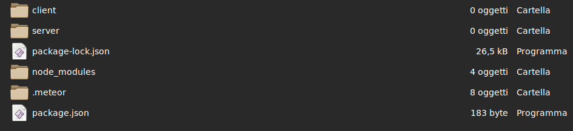
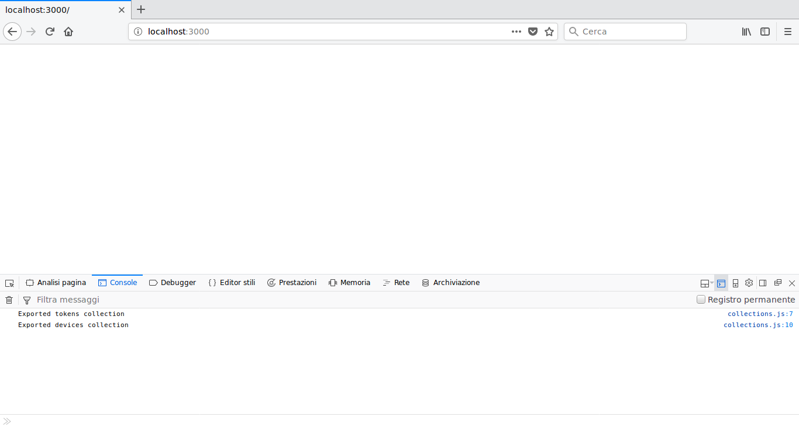

# Openthermo - Server IoT Open Source

Un'applicazione semplice e completa, per gestire tutti i tuoi termostati Openthermo.

Questo tutorial ti accompagnerà nella creazione di un programma javascript che controlla da remoto i termostati di casa e ufficio e organizza i loro dati in tempo reale.

Nel tutorial seguiremo questi step principali:

- conosciamo gli strumenti utilizzati
- prepariamo le parti fondamentali dell'applicazione
- otteniamo i dati di tutti i nostri device
- comandiamo il termostato da remoto
- riceviamo nuovi dati automaticamente

Questa è anche l'occasione per esplorare tutte le possibilità offerte da [Rotilio Maker](https://techmakers.io/rotilio-maker.html), la nostra piattaforma di sviluppo IoT basata su Photon/Electron di [Particle.io](https://particle.io).

## L'ambiente di sviluppo

Per creare la nostra app, utilizzeremo un framework, o piattaforma. I *framework* funzionano come "struttura portante" del software, connettendo i diversi file creati e mettendo a disposizione molte funzionalità.

Per questo progetto abbiamo scelto Meteor, che integra il database MongoDB. Meteor gestisce html e css (per creare Web App) e codice Javascript (che utilizzeremo in questo tutorial).
Perchè Meteor? Citando il tutorial per il firmware di Rotiliothermo, che controlla il nostro termostato,
<cite>Meteor è il framework Javascript che attualmente presenta il compromesso migliore tra portabilità, velocità di sviluppo e affidabilità di esecuzione sul maggior numero di piattaforme</cite>

Ecco le principali caratteristiche (e i vantaggi) di Meteor:

1. Utilizzo semplice, a riga di comando. Per creare, lanciare e visualizzare l'output di un'applicazione basta aprire un terminale nella cartella del progetto.
2. Database flessibile e facile da utilizzare. MongoDB è un database già incluso in Meteor, di tipo non relazionale. Offre utili e veloci funzioni di ricerca e inserimento dati.
3. Integrazione software-database. La gestione di MondoDB è completamente inserita nel javascript di Meteor, grazie a funzioni immediate e una ricezione istantanea di ogni modifica fatta ai dati.
4. Documentazione ricca e completa. La piattaforma offre, oltre a utili tutorial, un'ottima documentazione (vedi http://docs.meteor.com/#/full/), che consigliamo di visitare per un migliore approfondimento.

### Installazione di Meteor

Per iniziare, prepariamo la nostra piattaforma.

All'indirizzo https://www.meteor.com/install è possibile scaricare Meteor.

Eseguiamo il comando di installazione da terminale, se lavoriamo su un sistema operativo OSX o Linux, o scarichiamo il file di installazione per Windows.

### Creazione del progetto

Una volta installato Meteor, possiamo entrare nel vivo creando il nostro primo progetto.

Basta aprire un terminale nella directory dove vogliamo creare la nostra app, e digitare

```
meteor create --bare openthermo
```

Se l'installazione è stata eseguita correttamente, Meteor creerà la struttura base del nostro progetto. Il comando avrà un output simile:

```
Created a new Meteor app in 'openthermo'.

To run your new app:
  cd openthermo
  meteor

If you are new to Meteor, try some of the learning resources here:
  https://www.meteor.com/tutorials
```

I file del progetto saranno contenuti in una cartella con lo stesso nome dato all'applicazione.

### Usare MongoDB
MongoDB ha una struttura non relazionale: è orientato ai documenti, che funzionano esattamente come oggetti javascript. Con semplici funzioni possiamo effettuare Query, aggiornare campi o rilevare la modifica di alcuni dati. Quindi questo database è tipo *noSQL*: i nostri dati sono contenuti in un insieme di documenti in stile JSON e non in tabelle relazionali.

Per accedere a Mongo, dovremo innanzitutto aver lanciato la nostra applicazione tramite il comando *meteor* da un terminale aperto nella relativa cartella. Apriamo un nuovo terminale nella stessa directory e digitiamo

```
meteor mongo
```

se tutto andrà a buon fine, riceveremo questo output

```
MongoDB shell version: 3.2.15
connecting to: 127.0.0.1:3001/meteor
Server has startup warnings: 
2018-01-07T19:32:09.071+0100 I CONTROL  [initandlisten] 
2018-01-07T19:32:09.071+0100 I CONTROL  [initandlisten] ** WARNING: /sys/kernel/mm/transparent_hugepage/enabled is 'always'.
2018-01-07T19:32:09.072+0100 I CONTROL  [initandlisten] **        We suggest setting it to 'never'
2018-01-07T19:32:09.072+0100 I CONTROL  [initandlisten] 
2018-01-07T19:32:09.072+0100 I CONTROL  [initandlisten] ** WARNING: soft rlimits too low. rlimits set to 15413 processes, 1048576 files. Number of processes should be at least 524288 : 0.5 times number of files.
2018-01-07T19:32:09.072+0100 I CONTROL  [initandlisten] 
meteor:PRIMARY> 
```

Dalla shell *meteor:PRIMARY>* potremo lanciare utilissimi comandi per monitorare il db.


## I componenti del programma

Iniziamo lo sviluppo riassumento i compiti fondamentali che dovrà svolgere il programma:
- Comunicare con i device Particle, dalla chiamata di funzioni alla ricezione di variabili
- Applicare logiche, elaborare input e salvare dati nel database
- Creare e gestire le *collection* (insiemi di documenti) del database
Il modo migliore per scrivere il nostro codice è quello di concentrarci su ogni compito separatamente, organizzandolo in tre diversi file. Svilupperemo tre *componenti* autonome che interagiscono tra loro, in un unico programma facilmente leggibile e ampliabile.

### Struttura del progetto

Vediamo nel dettaglio i file del progetto creato, che comporranno la nostra app.

1. Le cartelle *node_modules* e *.meteor* contengono codice interno del framework, così come i file *package.json* e *package-lock.json*.
2. Creiamo le directory *server* e *client*, che conterranno invece i file principali della nostra applicazione.



Da questa struttura intuiamo una proprietà fondamentale del progetto: l'applicazione sarà divisa tra software *lato client* e *lato server* , contenuto nelle rispettive cartelle.
- Per *server* intendiamo la macchina su cui verrà eseguito il software "centrale" della nostra applicazione. E' il soggetto di questo tutorial, che svolgerà le funzioni fondamentali elencate sopra.
- Il *client* invece è qualsiasi macchina che, comunicando con il server, costruisce l'interfaccia della pagina web (l'App Mobile raccontata nel prossimo tutorial) utilizzando html e fogli di stile.

### Comunicazione - l'oggetto Particle

Il nostro obbiettivo è gestire in modo indipendente e dinamico tutte le comunicazioni con i termostati. 
Il modo più efficiente per farlo è creare un oggetto statico che conterrà tutte le funzioni di cui avremo bisogno. A quel punto basterà chiamare una funzione *Particle* indicando id del device, access token e eventuali parametri e la richiesta verrà gestita autonomamente!

Prepariamo il nostro oggetto *Particle* all'interno di un nuovo file *particle.js* in */server*

```
//object with methods to communicate with particle cloud and rotilios
export var Particle = 
{
}
```

#### Chiamate HTTP

Se avete letto il tutorial precedente, avrete scoperto come per ottenere il valore di una variabile accessibile da Rotilio basta inserire nella barra degli indirizzi del browser l'url:

```
https://api.particle.io/v1/devices/[id del device]/[nome della variabile]?access_token=[token account particle]
```

In realtà non stiamo facendo altro che inviare una *chiamata HTTP* al server Particle. Si tratta di una chiamata *GET*, che riceve dati; non possiamo infatti utilizare il browser per una chiamata *POST*, che invia dati.

Per utilizzare le chiamate http dal programma Meteor:
-aggiungiamo il package *http* da un terminale aperto nella directory del progetto

```
meteor add http
```

-importiamo l'oggetto *HTTP* in *particle.js*, subito prima del nostro oggetto *Particle*

```
import {HTTP} from 'meteor/http';
```


### Preparazione del database

Il prossimo passo è creare in MongoDB e esportare sul programma le *collection* che conterranno i documenti del database.

Vogliamo salvare e gestire questi gruppi di dati:
1.Access token. Ne potranno essere aggiunti diversi e ci serviranno per comunicare con i termostati. *Ogni documento (oggetto) conterrà un singolo access token*.
2.Termostati. Tutti i termostati connessi agli access token inseriti. *Ogni documento conterrà tutte le informazioni che ci interessano di un termostato*.

Prepariamo le collection *tokens*, *devices*, *settingsHistory* e *eventsHistory* (due storici che utilizzeremo più avanti) in */database/collections.js*.

```
//import database object
import { Mongo } from 'meteor/mongo';

////declare and export to other files collections
//list of access tokens
export const Tokens = new Mongo.Collection('tokens');
console.log("Exported tokens collection");
//list of device objects related to a token
export const Devices = new Mongo.Collection('devices');
console.log("Exported devices collection");
//history of all different settings of devices
export const SettingsHistory = new Mongo.Collection('settingsHistory');
//history of all different values of devices
export const EventsHistory = new Mongo.Collection('eventsHistory');
```

Abbiamo utilizzato questi comandi:
-*import { Mongo }* ha importato l'oggetto Meteor per interagire con MongoDB
-con *new Mongo.Collection('tokens');* abbiamo creato una nuova collection sul database
-grazie a *export const Tokens =*, "Tokens" sarà la variabile, con nome a piacere, dal quale la collection sarà accessibile.
-con *console.log()* scriviamo sul terminale i fondamentali log di debug.


### Logiche e funzioni del programma

Sviluppiamo la parte centrale del software in */server/main.js*. 

Come possiamo capire dal nome, *main.js* sarà il file di partenza dell'app Meteor. 
- Da qui richiamiamo gli altri due file del progetto: 

```
////add other components of the project
//particle static class to communicate with devices
import './particle.js';
//db declarations
import '/database/collections.js';
```

- Importiamo le collection create in *server/main.js*:

```
//import collection of tokens and devices
import {Tokens} from '/database/collections.js';
import {Devices} from '/database/collections.js';
import {SettingsHistory} from '/database/collections.js';
import {EventsHistory} from '/database/collections.js';
```

- Importiamo l'oggetto Particle

```
//import Particle class
import {Particle} from './particle.js';
```


In questo modo abbiamo connesso al programma le sue parti fondamentali.

Aggiungiamo un'istruzione Meteor utilissima per gestire l'applicazione:

```
Meteor.startup(function(){...});
```

La funzione argomento di *Meteor.startup* conterrà infatti le istruzioni che vogliamo eseguire quando lanciamo il nostro programma.


## Acquisizione dei dati dei device
Implementiamo nel nostro programma la sua prima abilità: ottenere e organizzare i dati di tutti i Rotilio connessi ai token aggiunti sul suo database. Possiamo dividere il lavoro di sviluppo in queste parti:
1. Comunicazione universale con Particle (oggetto Particle). Otterremo i dati dei dispositivi particle, a partire da un access token.
2. Pubblicazione dei dati lato client (publish e metodi). Renderemo token e device visualizzabili dall'esterno. Tramite dei metodi, i token potranno essere modificati.
3. Ricerca e salvataggio dei dispositivi. Ascolteremo l'aggiunta di nuovi token (observe) ottenendo e salvando sul db i dati dei device connessi.
4. Test del server. Utilizzando un browser connesso all'indirizzo http del server (localhost:3000) testeremo i metodi di gestione dei token, verificando dalla console la corretta ricerca dei device.

Passiamo allo sviluppo vero e proprio!

### Otteniamo device e dati tramite Particle
Costruiamo la funzione "universale" *Particle.listDevicesWithData* all'interno dell'oggetto *Particle* che, come abbiamo detto:
-riceve in input un qualsiasi access token (*access_token*).
-restituisce in output l'array di oggetti *device* (*devicesWithData*) connessi al token. Questi oggetti conterranno id, stato, token, funzioni e variabili con valore di tutti i dispositivi connessi al token in argomento.  

``` 
    listDevicesWithData : function (access_token)
    {
        var devicesWithData=[];
        ...richiesta dei dati
        return devicesWithData;
    },
```

Inviando chiamate HTTP *GET* otterremo le informazioni di cui abbiamo bisogno. Il modo più leggibile e coerente in cui suddividere la richiesta dei dati è dividendola in sottofunzioni: ognuna otterrà un dato diverso con la corrispondente chiamata HTTP.
-*Particle.listDevices* ottiene le informazioni base (id, nome, ecc.) di tutti i device dato un access token.
-*Particle.deviceInfo* ottiene un oggetto completo di tutti i campi (funzioni, variabili) per ogni device, dato il suo id.

Non ci resta che costruire la richiesta dei dati in questi passaggi elementari:
1. Salviamo in un array di oggetti (*devices*) le informazioni base restituite dalla prima funzione.

``` 
    ...
      //obtain list of devices related to the token
      var devices=this.listDevices(access_token);
    ...
```

2. Controlliamo che la sottofunzione non abbia restituito errori! Altrimenti, dobbiamo restituire l'errore assegnandolo a *devicesWithData*.

```
        ...
        //if devices does not contains error
        if(!devices.error)
        {
            ...continuiamo la richiesta dei dati
        }
        else
            //if devices contains a error object, it is copied into devicesWithData
            devicesWithData=devices;
        ...
```

3. Dati id e token di ogni *device* in *devices*, otteniamo un oggetto contenente tutti i suoi dati (nomi delle funzioni, nomi delle variabili, valori delle variabili, stato di connessione e gli stessi id e token). Aggiungiamo questo oggetto all'array *devicesWithData*, l'output della nostra funzione.

```
        //if devices does not contains error
        if(!devices.error)
        {
            devices.forEach(function(device) 
            {
                //for every device detected, obtain his information
                var deviceInfo=this.deviceInfo({device:device.id, access_token:access_token});
                //add device information into devicesWithData array
                devicesWithData.push({devicedata:deviceInfo, access_token:access_token, createdAt: new Date()});
            }, this);
        }
        else
            //if devices contains a error object, it is copied into devicesWithData
            devicesWithData=devices;
```

#### Lista dei device connessi a un access_token
Entriamo nel dettaglio: come chiediamo i vari dati a Particle attraverso le chiamate HTTP? Sfogliando la documentazione del sito, troviamo una chiamata che fa al caso nostro:

![Struttura della chiamata devices] (images/image02.png)

Osserviamo l'url della chiamata, che ottiene la lista dei device dati un token:

```
https://api.particle.io/v1/devices?access_token=[access_token]
```

La prima parte serve semplicemente per indirizzarci sul server di Particle. 
In sostanza, è comune agli url di tutte le chiamate al sito! 

Allora possiamo memorizzarla come *baseUrl* all'interno dell'oggetto Particle.

```
export var Particle = 
{
    baseUrl:'https://api.particle.io/v1/',

    ...
```

Per sfruttare questa chiamata costruiamo la prima sottofunzione: *Particle.listDevices*. Essa:
-riceve in input un qualsiasi access token (*access_token*).
-restituisce in output l'array di oggetti *device* (*devices*) connessi al token. Questi oggetti, come vediamo nell'immagine, conterranno però solo .

```
    ...

    listDevices : function (access_token)
    {
        //prepariamo in una stringa (requestUrl) l'url della richiesta HTTP
        var requestUrl = this.baseUrl+'devices/?access_token='+access_token;

        ...effettuiamo la chiamata

        return devices;
    },
```

Sviluppiamo la funzione in questi passaggi:
1. Scriviamo sul terminale la stringa *requestUrl* che stiamo per utilizzare. Questi output di debug sono molto semplici (basta utilizzare la funzione console.log(..)) e, se si spiega il contenuto dei valori visualizzati, estremamente utili.

```
        ...
        console.log("Particle - LIST DEVICES");
        console.log(requestUrl);
        ...
```

2. Tentiamo la chiamata, assegnando a *devices* l'oggetto *data* che otterremo. Con la struttura *try{ } catch{ }* eventuali errori nel contenuto di *try* verranno gestiti nelle istruzioni in *catch* senza interrompere il programma.

```
        ...
        try
        {
            var devices=HTTP.get(requestUrl).data;
        }
        catch (e)
        { }
        ...
```

3. Gestiamo l'eventuale errore *e* assegnando a *devices* l'oggetto di errore e visualizzandolo a console.

```
        catch (e)
        {
            //l'oggetto di errore è contenuto in e.response.data
            devices=e.response.data;
            //l'errore verrò restituito nell'oggetto devices
            console.log(devices);
        }
```

#### Lista dei valori di un device
Con *Particle.listDevices* abbiamo una lista sintetica dei device connessi ad un token. Ma il nostro obbiettivo è ottenere, per ciascuno, l'elenco completo dei suoi dati e, in aggiunta, i valori delle sue variabili. Per farlo sfruttiamo un'altra chiamata HTTP a Particle:

![Chiamata devices:deviceinfo] (images/image03.png)

Analizzando l'url della chiamata vediamo come abbia mantenuto lo stesso prefisso della precedente.

Costruiamo la sottofunzione *Particle.deviceInfo* in base al funzionamento della chiamata:
- Il suffisso dell'url richiede due parametri, id e access_token: i due campi che passeremo nell'oggetto *options* come input della funzione.
- La chiamata, come spiegato nella documentazione, restituisce un oggetto completo di id, dati, nomi delle funzioni e nomi delle variabili (questi ultimi raccolti in due array, *functions* e *variables*). Possiamo memorizzare questo oggetto come *device*, che restituiremo come output.

```
    deviceInfo : function (options)
    {
        //prepariamo in una stringa (requestUrl) l'url della richiesta HTTP
        var requestUrl = this.baseUrl+'devices/'+options.device+'/?access_token='+options.access_token;

        console.log("Particle - DEVICE VARIABLES");
        console.log(requestUrl);
        
        try 
        {
            var device=HTTP.get(requestUrl).data;
        }
        catch (e) 
        {
            //l'oggetto di errore è contenuto in e.response.data
            device=e.response.data;
            //l'errore verrò restituito nell'oggetto devices
            console.log(device);
        }

        //se la richiesta ha avuto esito positivo (e quindi non esiste il campo "error" di device)
        if (!device.error)
        {
            //spostiamo il valore del campo "name" (il nome del device) sul campo "particlename" 
            //per indicarlo come nome del Rotilio assegnato dall'account Particle.
            device.particlename=device.name;
            delete device.name;

            ... assegniamo ad ogni variabile in device.variables il suo valore
        }

        return device;
    },
```

Per restituire un oggetto *device* completo dei valori di ogni variabile, aggiungiamo questi ultimi passaggi:

1. Controlliamo che l'oggetto *device* contenga l'array *variables* dei nomi delle variabili e che il Rotilio sia connesso a internet.

```
        ...
        delete device.name;
        if(device.variables!=null && device.connected)
        {
            ...
        }

```

2. Prima di richiedere i valori di ogni variabile, accertiamoci che il device che stiamo esaminando sia un RotilioThermo: altrimenti il tempo utilizzato nelle chiamate sarebbe inutile!

```
        if(device.variables!=null && device.connected)
        {
            //in variablesNames memorizziamo il campo variables di device
            //utilizziamo Object.keys per memorizzarlo e poi usarlo come array
            variablesNames=Object.keys(device.variables);
            //variablesNames.indexOf, che restituisce -1 se il suo argomento non è un elemento dell'array)
            //in questo modo controlliamo la presenza di una variabile fondamentale per un firmware RotilioThermo,
            // ad esempio "heateron". In caso negativo chiudiamo la sottofunzione restituendo un oggetto nullo.
            if (variablesNames.indexOf("heateron") == -1) return ;
            ...

```

3. Per ogni elemento (nome di variabile) *variableName* nell'array *variableNames*, assegniamo al campo corrispondente nell'array *device.variables* il suo valore. Per ottenere questo valore chiamiamo una importante sottofunzione che andremo a costruire: *this.variableDevice*. Passiamo come parametro un oggetto contenente id del device, token e nome della variabile.

```
            ...
                variablesNames.forEach(function(variableName) 
                {
                    //this.variableDevice restituisce il valore di una variabile, volta per volta
                    device.variables[variableName]=this.variableDevice(
                    {
                        device:device.id, 
                        access_token:options.access_token, 
                        variablename:variableName
                    });
                }, this);
            ...
```

4. Per finire inseriamo il *forEach* appena costruito in una struttura *try...catch* che gestirà eventuali errori. Questa volta forziamo il codice a eseguire le istruzioni in *catch* con l'apposito comando *throw* che passa un'eccezione (errore) precedentemente dichiarato, *BreakException*.

```
            ...
            var BreakException = {};
            try 
            {
                variablesNames.forEach(
                {
                    ...
                    // all'interno di ogni ciclo controlliamo che la variabile ottenuto non contenga un oggetto di errore
                    // altrimenti usciamo dalle istruzioni in *try* entrando in *catch* grazie a *throw*
                    if(device.variables[variableName].error) throw BreakException;
                }, this);
            } 
            catch(e) {
                // nel caso l'errore e sia quello individuato e passato dal codice
                // impostiamo su false lo stato di connessione del dispositivo
                if(e==BreakException) device.connected=false;
            }
        }
```

#### Richiesta di una variabile
Completiamo la ricezione dei dati tramite l'oggetto Particle sfruttando la seguente, importantissima, chiamata HTTP.

![Chiamata variable] (images/image04.png)

Costruiamo la sottofunzione *Particle.variableDevice* basandoci sui parametri di input (id del device, access token, nome della variabile richiesta) e di output (valore della variabile) della chiamata stessa, come nelle precedenti sottofunzioni.

```
    variableDevice : function (options)
    {
        // costruiamo l'url della richiesta utilizzando i parametri di input
        var requestUrl = this.baseUrl+"devices/" + options.device + "/" + options.variablename + "?access_token=" + options.access_token;

        console.log("Particle - RICHIESTA DI VARIABILE:");
        console.log(requestUrl);

        try {
            // in res memorizziamo il campo data.result dell'oggetto restituito dalla chiamata, ovvero il valore della variabile
            var res = HTTP.get(requestUrl).data.result ;

        } catch (e){
            // gestiamo l'errore assegnando alla variabile da restituire l'oggetto di errore (e.response.data)
            res = e.response.data ;
            console.log(res);
        }

        return res ;
    },
```

### Rendiamo i dati accessibili e modificabili dall'esterno
Siamo pronti per il prossimo passo: rendere disponibili i dati (ricevuti dall'oggetto Particle e, come vedremo, salvati sul database) ai *client* che si connetteranno al nostro programma *server*. 

Per farlo, Meteor offre, lato server, due funzioni fondamentali. Le interazioni client-dati si dividono così in:
-lettura dei dati sul database, pubblicati dal server con *Meteor.publish()*
-modifica dei dati sul database tramite "metodi", funzioni lato server accessibili da client e dichiarati con *Meteor.methods()*

#### Meteor.publish pubblica i dati leggibili lato client
Il programma restituirà i dati di mongo ai client quando questi si connetteranno a una sua pubblicazione Meteor, detta "publish". Per aggiungere la publish di una collection utilizzeremo una funzione di questo tipo:

```
    Meteor.publish('[nome_publish]', function({
        ...eventuali istruzioni di preparazione dei dati
        ... return [documenti_mongo_pubblicati];
    }));
```

Questa struttura nasconde una potente proprietà. Infatti, una volta che un client è connesso ad una publish, ogni modifica dei dati sul db si propagherà automaticamente, senza bisogno di codice aggiuntivo, anche sui dati disponibili lato client.

Passiamo allo sviluppo inserendo in *server/main.js* la pubblicazione delle due collection più importanti create sul database mongo:

1. Pubblichiamo i documenti mongo (oggetti) della collection Tokens, attraverso la publish 'tokens.all'

```
    Meteor.publish('tokens.all', function () {

            // chiamiamo la funzione [collection].find()
            // che restituisce l'array dei documenti che contengono campi e valori passati nel parametro
            return Tokens.find(
            {
                // se il parametro è un oggetto vuoto verranno restituiti tutti i documenti della collection
                // quindi sono pubblicati tutti gli access token
            });
    });
```

2. Pubblichiamo i documenti mongo (oggetti) della collection Devices, attraverso la publish 'devices.token'. In questo caso, al client verranno restituiti solamente gli oggetti con l'access token uguale a quello passato come parametro.

```
    //publish to client all the devices with the given access_token
    Meteor.publish('devices.token', function (access_token) {    
            return Devices.find(
                {
                    // in questo caso il client riceve solo i documenti (oggetti) dei device 
                    // che contengono l'access token indicato
                    access_token: access_token
                }
            );
    });
```


#### Meteor.methods contiene le funzioni richiamabili lato client
L'ultimo passo da fare per poter interagire dall'esterno con i dati del server è aggiungere dei "metodi Meteor". Si tratta di funzioni, come nelle publish, richiamabili da client. Sarà all'interno di questi metodi, quindi lato server, che si modificheranno i dati del db.

Grazie alla funzione *Meteor.methods()* aggiungiamo nuovi metodi scrivendo:

```
    Meteor.methods({

        '[nome_metodo]' ([parametri])
        {
            ...istruzioni
        },

        '[nome_secondo_metodo]' ([parametri])
        {
            ...istruzioni
        },
        ...
    });
```

Possiamo notare che i "metodi" devono essere aggiunti in una lista passata come argomento a *Meteor.methods()*.

Con il nuovo strumento possiamo dichiarare, sempre in *server/main.js*,  il metodo *'token.add'* che aggiunge l'access token passato in argomento alla collection sul database, e *'token.remove'* che lo rimuove.

```
    //server methods that will be visible from client
    Meteor.methods({

        'token.add'(access_token)
        {
            //il metodo upsert modifica o crea un documento nella collection Tokens
            Tokens.upsert(
                //il primo parametro indica gli attributi che deve avere un doc già esistente per essere modificato
                //in caso nessun doc venga trovato, viene creato un nuovo doc
                {access_token:access_token},
                // con $set impostiamo il nuovo valore del campo access_token
                {$set: { access_token:access_token } }
            );
        },

        'token.remove'(access_token)
        {
            //remove rimuove dalla collection Tokens tutti i doc con l'attributo indicato
            Tokens.remove( {access_token:access_token} );
        },
    });
```

A questo punto chiunque sia connesso all'indirizzo web del nostro programma (di default *localhost:3000*), per esempio da un browser, può leggere e modificare la lista degli access token sul database.


### Ricerca e salvataggio dei device

Siamo quasi pronti per testare il programma da browser e terminale. Prima, però, dobbiamo completare le logiche del nostro server. 
In questa ultima parte infatti vogliamo connettere la presenza di access token nella collection Tokens all'aggiunta di oggetti device in Devices. Procediamo in questo modo:
1. Prepariamo il metodo Meteor *'devices.find'*. Questo, dato un token, aggiunge nel database (o aggiorna se già presenti) i device che otterremo con la funzione *Particle.devicesWithData*.
2. Sfruttiamo l'interazione Mongo-Meteor, per chiamare *'devices.find'* da codice, ogni volta che è necessario sincronizzare i device di un dato token.

Inserito questi ultimi tasselli, il programma gestirà in modo completamente autonomo la ricerca dei dispositivi connessi, il salvataggio delle loro proprietà, e l'intero database token-device.

#### Il metodo 'devices.find'
Iniziamo dichiarando il nuovo metodo, aggiungendolo nello spazio utilizzato prima.

```
Meteor.methods({
    ...

    'devices.find'(access_token) {        
        ...otteniamo e salviamo i dati dei device
    },
});
``` 

Salviamo subito nella variabile *devices* i dispositivi connessi all'*access_token* passato che l'oggetto Particle otterrà per noi. Se le richieste HTTP sono state completate, nessun oggetto di errore sarà stato inserito in *devices*.

```
    'devices.find'(access_token) {        
        //ask an array of all particle devices with the added token
        //containing all variables, functions name and token
        var devices = Particle.listDevicesWithData(access_token);

        //visualizziamo sulla console gli oggetti device ottenuti
        console.log(devices);

        //controlliamo che la variabile non contenga errori
        if(devices.error==null)
        {
            ... salvataggio sul database dei dati
        }
    },
```

Per finire, aggiungiamo ogni oggetto *device* dell'array *devices* a un documento nella collection Devices. Utilizzando *upsert*, se è già presente il documento di un device ottenuto ci limitiamo a modificarlo, evitando duplicati.

```
        if(devices.error==null)
        {
            //insert in the db all devices element of the array
            devices.forEach(function(device) {
                //usciamo dal metodo senza salvataggi se l'oggetto non contiene dati
                if (!device.devicedata) return ;
                //con upsert aggiungiamo i campi dell'oggetto device al documento con l'id corrispondente (specificato nel primo parametro)
                //nel caso non esista nessun documento con quell'id, verrà creato un nuovo documento per il device
                Devices.upsert({"devicedata.id":device.devicedata.id}, {$set:device});
            });
        }
```

#### Risposta all'aggiunta di un token con *observe*
Con la funzione Meteor observe: *[collection].find([filtro]).observe({...})* è possibile eseguire istruzioni automaticamente, ogni volta che gli oggetti in una collection Mongo (quelli con gli attributi passati in *find*) vengono modificati o aggiunti.
Come spiega la documentazione ufficiale, le istruzioni all'interno delle graffe di *observe* devono appartenere a una delle seguenti funzioni: added, changed, removed.

Ecco i passaggi per la costruzione di un *observe* su *Tokens* che sincronizzi i device ogni volta che un nuovo token è aggiunto alla collection.
1. Inseriamo la observe in *server/main.js*. Per evitare di ripetere la gestione dell'aggiunta di un token, osserviamo solo i documenti che non contengono il campo *updatedOn*, che aggiungeremo ad ogni documento durante la sua gestione.

```
//execute code when list of all tokens (Tokens.find({})) changes
Tokens.find({updatedOn:{$exists:false}}).observe({ ... });
```

2. Inseriamo le istruzioni nella funzione *added (doc) { ... }* , che le eseguirà ogni volta che un documento (il parametro *doc*) viene aggiunto a quelli filtrati.

```
//execute code when list of all tokens (Tokens.find({})) changes
Tokens.find({updatedOn:{$exists:false}}).observe({

    //code executed when a token document is added
    ////id: token document id
    ////token: the new token
    added (doc) {
        //output di debug sulla console
        console.log("New token added:");
        console.log(doc.access_token);
        //chiamiamo il metodo che sincronizza i device, passando come token il campo access_token del documento aggiunto
        Meteor.call("devices.find", doc.access_token);
        //con update aggiorniamo il documento aggiunto, aggiungendogli il campo updateOn grazie al tag {$set: {[campo_da_aggiornare]: [nuovo_valore]}
        Tokens.update(doc._id,{$set:{updatedOn:new Date()}});
    }
});
```


### Test software della gestione token

Lanciamo il programma da un terminale aperto nella cartella del progetto. Inviando il comando

```
meteor
```

dovremmo ottenere l'output

```
=> Started proxy.                             
=> Started MongoDB.                           
I20180122-00:29:46.195(1)? Exported tokens collection
I20180122-00:29:46.230(1)? Exported devices collection
=> Started your app.

=> App running at: http://localhost:3000/

```

Come indicato nell'output, il nostro programma sarà in ascolto sull'indirizzo localhost:3000.

Inseriamo questa url nel browser, e attiviamo gli strumenti per sviluppatori con *ctrl-shift-i*.



Per aggiungere un nuovo token, digitiamo il comando *Meteor.call('token.add', [nuovo_access_token]) nella console degli strumenti per sviluppatori.
A quel punto, sul terminale dovremmo ricevere tutti gli output di debug, e potremo seguire passo dopo passo la ricezione dei dati dei diversi device.

In pratica, il programma sviluppato fino a adesso è autosufficiente. Potete ottenerne una copia scaricandola da qui: [serverthermo_step01.zip](indirizzo del primo zip).


## Invio di comandi ai termostati
Fino ad ora ci siamo limitati a sincronizzare il database Openthermo con i dati degli access token aggiunti. Ma la potenzialità di Rotilio non sta solo nel pubblicare dati: il termostato può essere comandato da remoto, anche da software. Tutto sempre con le semplici chiamate HTTP già utilizzate, che questa volta saranno di tipo POST e conterranno un argomento.

Possiamo modificare queste impostazioni:
- Stato di accensione. Decide se il sistema di riscaldamento è forzato a spento () oppure attivo (). Su Rotilio, è memorizzato nella variabile *heateron* e viene modificato dalla funzione *setheater*.
- Temperatura desiderata. E' la temperatura dell'ambiente che l'utente vuole raggiungere grazie al riscaldamento, compresa tra 18 e 26 gradi. Corrisponde alla variabile *tempsetpoint* e viene modificata dalla funzione *settemp*.

Dopo questa sezione il server Iot Openthermo sarà in grado di:
1. Dare al client la possibilità di aggiungere una nuova *impostazione* nel documento Mongo di un device.
2. Gestire l'aggiunta di una nuova *impostazione*, sincronizzandola con il termostato e memorizzando l'esito della modifica.
3. Inviare il comando vero e proprio a Rotilio, chiamando la funzione corrispondente alla variabile da modificare tramite richieste HTTP POST.

### Aggiungiamo l'impostazione del device
Perchè l'utente lato client possa impostare un dispositivo, il suo input dovrà prima di tutto modificare l'oggetto del dispositivo nel database del programma. Procederemo nel modo più efficace possibile, sfruttando i metodi Meteor per proteggere i dati dall'esterno e la struttura a oggetti del db Mongo.

#### Il campo *update* dell'oggetto termostato
Iniziamo progettando il nuovo campo *update* dell'oggetto termostato. In questo campo memorizzeremo le modifiche delle variabili non ancora sincronizzate, ottenendo questi vantaggi:
- nessuna sovrascrizione delle variabili *tempsetpoint* e *heateron* finchè i valori non sono sincronizzati, evitando il rischio di perdere dati.
- semplice gestione delle nuove impostazioni. Il campo *update* raggruppa in modo chiaro i dati utili all'invio di un nuovo comando.

Ecco la struttura del campo *update*, che contiene a sua volta un oggetto con diversi campi.

```
{
    update:
    {
        status: [indica lo stato di sincronizzazione della nuova impostazione]
        variablename: [nome della variabile da impostare, "heateron" o "tempsetpoint"]
        argument: [nuovo valore della variabile]
    }
}
```

Attraverso il campo *update.status* indichiamo se il comando di modifica della variabile deve ancora essere inviato al termostato, oppure l'esito della sincronizzazione. Riassumendo, potrà assumere i valori:
- *"pending"* nel caso l'impostazione sia in attesa di essere sincronizzata.
- *"updated"* se l'impostazione è stata correttemente sincronizzata sul termostato.
- *"invalid"* quando la funzione chiamata su Rotilio rifiuta il nuovo valore inviato.
- *"error"* quando è impossibile raggiungere il termostato o la chiamata HTTP restituisce un altro errore.

#### Impostazione di un nuovo comando
Vediamo come aggiungere una nuova impostazione nell'oggetto *update* grazie a un metodo Meteor, *'device.update'*, accessibile anche dall'esterno.
1. Aggiungiamo il metodo all'interno della lista dei metodi pubblicati, nella funzione *methods*.

```
Meteor.methods({
    ...
    'device.update'(info) 
    {

    },
    ...
});
```

2. L'oggetto *info* che l'utente passerà chiamando *'device.update'* conterrà i campi:
- access_token, l'indispensabile token che permette all'utente di modificare un suo dispositivo sul nostro db. Il resto delle istruzioni sarà eseguita solo se il token è presente sul database.

```
    ...
    'device.update'(info) 
    {
        //findOne restituisce il primo oggetto Mongo con gli attributi indicati
        token=Tokens.findOne({access_token:info.access_token});
        //eseguiamo le istruzioni solo se "token" non è nullo
        if(token)
        {
            ...
        }
    },
    ...
```

- id, l'id del dispositivo grazie al quale individuiamo e mememorizziamo il documento Mongo del termostato.

```
        ...
        if(token)
        {
            //findOne restituirà il primo oggetto in Devices con id e token specificati
            device=Devices.findOne({
                //il tag $and [{condizione1}, {condizione2}, ...] permette di filtrare i risultati controllando più attributi
                "$and":
                [
                    {"devicedata.id":info.id},
                    {access_token:info.access_token}
                ]
            }); 
            ...
```

- variablename e argument, che contengono i valori dei corrispondenti campi *update.variablename* e *update.argument*. Lo *status* di *update* sarà impostato su *"pending"*, in attesa che la variabile venga sincronizzata.

```
            ...
            //con [collection].update({filtro},{modifiche}) impostiamo i documenti di Devices corrispondenti al filtro applicato
            Devices.update(
            {
                //filtriamo con $and secondo id e access_token indicati
                "$and":
                [
                    {"devicedata.id":info.id},
                    {access_token:info.access_token}
                ]
            },
            {
                //con $set impostiamo i nuovi valori dei tre campi di *update* del device
                $set:
                {
                    "update.status": "pending", 
                    "update.variablename": info.variablename,
                    "update.argument": info.argument
                }
            });
        }
    //fine del metodo 'device.update'
    },
    ...
```


### Inviamo una nuova impostazione
Ora l'utente esterno può aggiungere una nuova impostazione sull'oggetto Mongo di un termostato, tramite *'device.update'*. Il compito del server sarà gestire automaticamente la sincronizzazione tra quanto salvato nel campo *update* e le variabili del dispositivo.

#### Ascoltiamo le modifiche da sincronizzare in *update*

Per prima cosa, il programma deve 'accorgersi' automaticamente della presenza di un nuovo termostato con impostazioni da sincronizzare. 

Abbiamo creato il campo update proprio per questo: ogni volta che il client cambia un'impostazione, un oggetto termostato viene aggiunto alla lista dei documenti con campo *update.status* settato su *"pending"*. Per eseguire le istruzioni di sincronizzazione in modo automatico, basterà inserirle nella funzione *added* di una *observe* su questo gruppo di oggetti!

```
//execute code when list of devices to update (status: "pending") changes
Devices.find({"update.status" :"pending"}).observe({

    //if a device is added to the list it has to be synchronized 
    ////doc: the device document whose update status was set to "pending"
    added (doc) {
        ...istruzioni di sincronizzazione
    }
});
```       

#### Sincronizzazione della variabile
La sincronizzazione sfrutterà una funzione dell'oggetto Particle, che aggiungeremo tra poco: *Particle.functionDevice*. 

Questa, dati token, id di un device, nome di una funzione e argomento, eseguirà una chiamata POST alla funzione del Rotilio. Ecco le fasi della sincronizzazione:

1. Prepariamo un oggetto (*options*). *options* sarà l'argomento di *Particle.functionDevice*, quindi deve contenere tutte le informazioni per chiamare, su Rotilio, la funzione che modifica la variabile di *update.variablename*.

```
    added (doc) {
        //dichiaro l'oggetto options che contiene i parametri per impostare Rotilio tramite una sua funzione
        options =
        {
            device:doc.devicedata.id, 
            access_token:doc.access_token, 
            //il campo functionToVariable dell'oggetto Particle sarà un oggetto i cui campi sono i nomi delle variabili del termostato, e i valori i nomi delle funzioni che le modificano
            //in questo modo, possiamo associare al campo functionname il corretto nome della funzione da chiamare su Rotilio
            functionname:Particle.functionToVariable[doc.update.variablename],
            //convertiamo in formato Stringa il nuovo valore da passare alla funzione
            argument:doc.update.argument.toString()
        }
        //output di debug sulla console, che visualizza il nome del device in sincronizzazione e l'oggetto options
        console.log("Trying to update device: ", doc.devicedata.name, options);
        ...
```

2. Salviamo su *result* l'esito della chiamata al Rotilio, controllando che i dati in *update* siano corretti. Otteniamo l'oggetto Mongo del termostato che stiamo impostando a partire dal suo id.

```
        ...
        //se options.functionname contiene il nome di una funzione su Rotilio, il nome della variabile da modificare in *update* è corretto
        if(options.functionname)
        {
            //con il parametro options passiamo le informazioni utili all'oggetto Particle 
            result=Particle.functionDevice(options);
        }

        var deviceid = doc.devicedata.id;
        thermo=Devices.findOne({"devicedata.id":deviceid});

        ...salvataggio dell'esito della sincronizzazione

```

#### Memorizziamo l'esito del comando
A questo punto, *result* può contenere:
- Il valore *0*, restituito dalla funzione su Rotilio, se la modifica è avvenuta con successo.
- Un valore negativo, restituito dalla funzione su Rotilio, quando la modifica non avviene perchè l'argomento passato è stato rifiutato.
- Un oggetto di errore in caso di fallimento della chiamata HTTP POST.
Nei tre diversi casi:
1. Impostiamo il corretto valore di *update.status0* e quello di connessione al dispositivo (che sarà negativo in caso di errore HTTP) dell'oggetto *thermo*. 
2. Salviamo nel database, in Devices, l'oggetto thermo, sostituendolo con *update* al vecchio documento dello stesso termostato (quindi avente lo stesso id).
NB: Solamente nel caso di corretta sincronizzazione, aggiorniamo anche la variabile modificata nei dati interni del dispositivo, salvando poi l'oggetto anche nello storico delle impostazioni.

```
        ...

        //la funzione restituisce zero, quindi la sincronizzazione è completata
        if (result==0)
        {
            //1. update status so that a new setting to "pending" will trigger again this observer
            thermo.update.status = "updated";
            thermo.devicedata.connected=true;

            //2. update the changed variable in the definitive datas in the doc
            thermo.devicedata.variables[doc.update.variablename] = doc.update.argument;
            //salvataggio delle modifiche all'oggetto thermo in Devices con update
            Devices.update({"devicedata.id":deviceid}, thermo);
            //eliminiamo l'id interno del documento per poterlo aggiungere nello storico delle impostazioni, SettingsHistory
            delete thermo._id;
            SettingsHistory.insert(thermo);

            //output di debug, completo di oggetto termostato che si stava sincronizzando
            console.log("Update: successfull", thermo);
        }
        //la funzione restituisce un val. negativo, quindi l'argomento era invalido
        else if (result>0)
        {
            thermo.update.status = "invalid";
            thermo.devicedata.connected = true;
            //salvataggio delle modifiche all'oggetto thermo in Devices con update
            Devices.update({"devicedata.id":deviceid}, thermo);
            //output di debug, completo di oggetto termostato che si stava sincronizzando
            console.log("Update: value not valid", thermo);
        }
        //altrimenti, non è stato possibile comunicare con Rotilio
        else
        {
            thermo.update.status = "error";
            thermo.devicedata.connected = false;+            //salvataggio delle modifiche all'oggetto thermo in Devices con update
            Devices.update({"devicedata.id":deviceid}, thermo);
            //output di debug, completo di oggetto termostato che si stava sincronizzando
            console.log("Update: no response", thermo);
        }

    //chiusura della funzione added..
    }
//..e della observe
});
```

### Chiamata di una funzione sul device
Completiamo il codice per comandare il termostato a seconda delle decisioni dell'utente con la funzione che invia il comando a Rotilio vero e proprio: *Particle.functionDevice*.

In realtà, non faremo altro che sfruttare la chiamata POST che il server Particle mette a disposizione per chiamare una funzione pubblicata sul dispositivo. Sarà poi la funzione del firmware RotilioThermo a modificare le variabili del termostato a seconda dell'argomento ricevuto. In ordine:

1. Dichiariamo la funzione all'interno dell'oggetto Particle, in *server/particle.js*, che riceve l'oggetto options come input (che dovrà contenere i campi access_token, id, functionname e argument) e restituisce *returnvalue*.

```
    ...
    functionDevice : function (options)
    {
        var returnvalue=-1;
        ...richiesta HTTP POST       
        return returnvalue ;
    },
    ...
```

2. Prepariamo l'url della chiamata, utilizzando il prefisso *baseUrl* e i parametri di input.

```
        ...
        var requestUrl = this.baseUrl+"devices/" + options.device + "/" + options.functionname;
        //output di debug, che indica l'url della chiamata e l'argomento che verrà passato
        console.log("Particle - CHIAMATA FUNZIONE:") ;
        console.log(requestUrl, options.argument) ;
        ...
```

3. Effettuiamo la chiamata POST, salvando l'esito in *res*. Il valore restituito dalla funzione, assegnato a *returnvalue*, è contenuto nel campo *return_value* di *res.data*.
NB: In questo caso, la funzione Meteor HTTP.post accetta come secondo parametro access token e argomento da inviare alla funzione RotilioThermo.

```
        ...
            res=HTTP.post(requestUrl, {params: 
                {
                    access_token : options.access_token,
                    args: options.argument 
                }
            });
            console.log(res);
            returnvalue=res.data.return_value;   
        ...
```

4. Inseriamo la chiamata post in una struttura try{...}catch(e){...} per gestire eventuali errori HTTP.

```
        ...
        try 
        {

            res=HTTP.post(requestUrl, {params: 
                {
                    access_token : options.access_token,
                    args: options.argument 
                }
            });
            console.log(res);
            returnvalue=res.data.return_value;          
        } 
        catch (e)
        {
        
            res = e;
            console.log(res);
        }
        ...
```

#### Associamo funzioni e variabili
Prima di testare il programma cambiando le impostazioni del nostro termostato direttamente dal browser, ricordiamoci di aggiungere l'oggetto *Particle.functionToVariable*. Questo campo dell'oggetto Particle associa i nomi delle variabili in RotilioThermo alle funzioni che le modificano.

```
    functionToVariable : {tempsetpoint: 'settemp', heateron: 'setheater'}
```

Anche dopo questa sezione abbiamo ottenuto un programma autonomo. Ecco dove scaricare il progetto fino a questo punto: [serverthermo_step02.zip](indirizzo del secondo zip).


## Ricezione automatica di nuovi dati
Il programma lato server Openthermo permette all'utente, fino a qui, di ottenere i dati dei suoi termostati organizzati in un db, e di cambiare le impostazioni di accensione e temperatura di ognuno. Ma non abbiamo ancora tenuto conto (volutamente) del fatto che i valori di temperatura ambiente, attività ecc. di ogni termostato cambiano costantemente.

In questa ultima parte di tutorial, il nostro obbiettivo sarà di ricevere e salvare in modo automatico, in tempo reale, i dati aggiornati dei dispositivi.

### Ascoltare gli eventi dei device Particle
Per ricevere nuovi dati dai RotilioThermo, la cosa più naturale da fare è ascoltare gli eventi (*relaisset*, *relaisreset*, *tempchanged*). Questi eventi sono pubblicati automaticamente dal firmware del termostato, dopo un cambiamento nell'attività del sistema di riscaldamento o nella temperatura rilevata.
[image]
Per fare ciò utilizzeremo *eventsource*, un pacchetto Meteor npm che ci permetterà di rimanere in "ascolto" degli eventi pubblicati dai RotilioThermo sul server Particle. *eventsource* è simile alle chiamate HTTP - si collega ad un URL Particle - anche se crea una vera e propria *connessione* tra il server Openthermo e quello Particle.

Diamo un'occhiata all'url con cui costruiremo la nostra istanza *eventSource*:

```
https://api.particle.io/v1/devices/events?access_token=[access_token]
```

Dobbiamo specificare solo l'access token! Questo significa che con un unico *eventSource* riceveremo gli eventi pubblicati da tutti i dispositivi connessi a un token.
#### Aggiunta del pacchetto *eventsource*
Per installare il pacchetto digitiamo da un terminale aperto nella directory del progetto openthermo:

```
meteor npm install eventsource
```

Se l'aggiunta è avvenuta correttamente, riceveremo un output simile

```
+ eventsource@1.0.5
added 5 packages in 3.424s
```

Importiamo poi l'oggetto del pacchetto all'interno dell'oggetto particle, in *server/particle.js*, con il metodo Npm.require();

```
    EventSource : Npm.require('eventsource'),
```

#### Gestiamo gli eventi ricevuti
Dichiariamo la funzione *Particle.eventSource* all'interno dell'oggetto Particle, sempre in *server/particle.js*. *Particle.eventSource* verrà chiamata ogni volta che si vuole associare una serie di istruzioni ad un singolo evento di un singolo access token. Gli argomenti di input saranno quindi:
-*access_token*: l'access token dei dispositivi dei quali ascoltare l'evento
-*eventname*: il nome dell'*unico evento* da ascoltare..
-*callback*: ..e la relativa funzione di callback (passata come argomento) che contiene le istruzioni da eseguire quando si riceve l'evento.

```
...
    eventSource : function(access_token, eventname, callback)
    {
        ...inizializzazione dell'eventsource
        ...ascolto dell'evento "eventname" che chiamerà la funzione "callback"
    }
...
```

All'interno della funzione, costruiamo l'istanza *eventSource* dell'oggetto *EventSource*, specificando l'url di ascolto.

```
    {
        var particleUrl="https://api.particle.io/v1/devices/events?access_token="+access_token;
        //output di debug, che indica l'url di ascolto particleUrl
        console.log("Preparing eventsource:",particleUrl);
        //costruaimo l'istanza eventSource
        var eventSource = new EventSource(particleUrl);
        ...
```

A questo punto basta utilizzare la comune funzione javascript *addEventListener* sull'istanza creata, specificando il nome dell'evento, nel primo parametro, e le istruzioni di elaborazione del dato e la chiamata della callback, nel secondo.

```
        ...
        eventSource.addEventListener(eventname,function(e) 
        {
            //otteniamo un oggetto Fiber per eseguire in modo sincrono l'elaborazione dei dati
            Fiber = Npm.require('fibers');
            //all'interno di Fiber(...).run(); inseriamo la funzione di elaborazione
            Fiber(function(){
                //il dato relativo all'evento è contenuto all'interno di e.data
                //convertiamo il dato dal formato stringa ad un oggetto javascript con JSON.parse()
                data = JSON.parse(e.data);
                //output di debug con il dato dell'evento ricevuto
                console.log("eventsource - EVENTDATA:",data);
                //chiamiamo la funzione di callback, inserendo data come argomento
                callback(data)
            }).run();
        });    
    }
```


### Salviamo i dati ricevuti
L'oggetto Particle mette a disposizione *Particle.eventSource* per connettere un evento su un access token a una funzione di callback. Ma cosa sono queste funzioni di callback?
Sono blocchi di istruzioni fondamentali in *server/main.js* (*relaissetEvent*, *relaisresetEvent*, *tempchangedEvent*) che:
- ricevono i dati dei tre rispettivi eventi dei termostati RotilioThermo (*relaisset*, *relaisreset*, *tempchanged*)
- aggiornano la collection Devices a seconda dei dati ricevuti.

```
relaissetEvent = function(data)
{
    ...
};

relaisresetEvent = function(data)
{
    ...
};

tempchangedEvent = function(data)
{
    ...
};
```

#### Accensione, spegnimento o nuova temperatura del termostato
Le tre funzioni sviluppano in questi passaggi:
1. Salvataggio, in *thermo*, dell'oggetto Mongo del device che ha inviato l'evento, tramite il suo id contenuto in *data.coreid*. NB: nel caso di tempchangedEvent, viene memorizzata anche la nuova temperatura contenuta in *data.data*.

```
relaissetEvent = function(data)
{
    var deviceid = data.coreid;
    //findOne restituisce il primo documento in Devices del termostato con l'id specificato 
    thermo = Devices.findOne({"devicedata.id":deviceid});
    //output di debug con id del device e nome dell'evento
    console.log("Receiving from device: ", deviceid);
    console.log("--relais: set");
    ...
};

relaisresetEvent = function(data)
{
    var deviceid = data.coreid;
    //findOne restituisce il primo documento in Devices del termostato con l'id specificato
    thermo = Devices.findOne({"devicedata.id":deviceid});
    //output di debug con id del device e nome dell'evento
    console.log("Receiving from device: ", deviceid);
    console.log("--relais: reset");
    ...
};

tempchangedEvent = function(data)
{
    var temp = data.data;
    var deviceid = data.coreid;
    //findOne restituisce il primo documento in Devices del termostato con l'id specificato
    thermo = Devices.findOne({"devicedata.id":deviceid});
    //output di debug con id del device, nome dell'evento e nuovo valore della temperatura
    console.log("Receiving from device: ", deviceid);
    console.log("--temperature: ", temp);
    ...
};
```

2. Aggiornamento dell'oggetto thermo
- modificando le variabili cambiate con l'evento
- impostando lo stato di connessione con il dispositivo a *true*
- creando un oggetto *event* in *thermo* che racchiuderà nome (*thermo.event.eventname*), nuovo valore (*thermo.event.argument*) e tempo (*thermo.event.time*) dell'evento ricevuto.

```
relaissetEvent = function(data)
{
    ...
    // se il termostato è spento allora la variabile relaisaorb deve assumere valore "1"
    thermo.devicedata.variables.relaisaorb = 1;
    thermo.devicedata.connected=true;   
    thermo.event={};
    thermo.event.eventname = "relaisset";
    thermo.event.argument = 1;
    //con new Date() si ottiene data e ora in cui si sta effettuando il salvataggio dell'evento
    thermo.event.time = new Date();
    ...
};

relaisresetEvent = function(data)
{
    ...
    // se il termostato è spento allora la variabile relaisaorb deve assumere valore "0"
    thermo.devicedata.variables.relaisaorb = 0;
    thermo.devicedata.connected=true;
    thermo.event={};
    thermo.event.eventname = "relaisreset";
    thermo.event.argument = 0;
    //con new Date() si ottiene data e ora in cui si sta effettuando il salvataggio dell'evento
    thermo.event.time = new Date();
    ...
};

tempchangedEvent = function(data)
{
    ...
    //la variabile temperature del termostato è settata al valore "temp" memorizzato precedentemente
    thermo.devicedata.variables.temperature = temp;
    thermo.devicedata.connected=true;
    thermo.event={};
    thermo.event.eventname = "tempchanged";
    thermo.event.argument = temp;
    //con new Date() si ottiene data e ora in cui si sta effettuando il salvataggio dell'evento
    thermo.event.time = new Date();
    ...
};
```

3. Salvataggio dell'oggetto thermo sovrascrivendo il precedente documento Mongo con *update* e in un nuovo documento nello storico degli eventi *EventsHistory* con *insert*.

```
relaissetEvent = function(data)
{
    ...
    Devices.update({"devicedata.id":deviceid}, thermo);
    //eliminiamo l'id interno dell'oggetto thermo per poterlo inserire in una diversa collection
    delete thermo._id;
    EventsHistory.insert(thermo);
};

relaisresetEvent = function(data)
{
    ...
    Devices.update({"devicedata.id":deviceid}, thermo);
    //eliminiamo l'id interno dell'oggetto thermo per poterlo inserire in una diversa collection
    delete thermo._id;
    EventsHistory.insert(thermo);
};

tempchangedEvent = function(data)
{
    ...
    Devices.update({"devicedata.id":deviceid}, thermo);
    //eliminiamo l'id interno dell'oggetto thermo per poterlo inserire in una diversa collection
    delete thermo._id;
    EventsHistory.insert(thermo);
};
```

### Lanciamo l'ascolto degli eventi dei termostati

Abbiamo preparato sia la funzione che apre l'ascolto di un evento, *Particle.eventSource*, sia le funzioni di callback associate ad ogni evento. L'ultimo passaggio consiste nel lanciare l'apertura dei vari eventi per ogni access token nel nostro database.

#### Eventi dei nostri Openthermo

All'apertura del programma, dovremo instaurare una connessione *eventsource* con il server Particle per ogni access token disponibile.

Per farlo, utilizziamo la funzione Meteor startup, il cui argomento viene eseguito all'avvio del programma.

```
Meteor.startup(function()
{
    //ottengo e converto in array tutti i token in Tokens
    tokens=Tokens.find({}).fetch();
    //per ogni oggetto token in tokens..
    tokens.forEach(function(token){
        //..connetto le tre funzioni di callback al loro evento, utilizzando la funzione Particle.eventSource(access_token, nome_evento, funzione_callback)
        Particle.eventSource(token.access_token, "relaisset", relaissetEvent);
        Particle.eventSource(token.access_token, "relaisreset", relaisresetEvent);
        Particle.eventSource(token.access_token, "tempchanged", tempchangedEvent);
    });
});
```

#### Eventi di nuovi termostati inseriti
Anche nel caso un access token venga inserito dall'utente, dovremo connettere i tre eventi. 

Modifichiamo allora la observe sull'aggiunta dei token, inserendo:

```
Tokens.find({updatedOn:{$exists:false}}).observe({

    added (doc) {
        ...
        Particle.eventSource(doc.access_token, "relaisset", relaissetEvent);
        Particle.eventSource(doc.access_token, "relaisreset", relaisresetEvent);
        Particle.eventSource(doc.access_token, "tempchanged", tempchangedEvent);
    }
});
```


Abbiamo ottenuto un programma lato server in grado non solo di cambiare le impostazioni di diversi termostati, ma di organizzare in un database tutti i loro dati aggiornati in tempo reale: ecco la vera potenzialità dell'IoT.

Se ti va, puoi scaricare il programma completo da qui: [serverthermo_step03.zip](indirizzo del terzo zip).